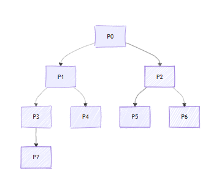

#+title: Exercise 2 Notes
#+author: jfrp
#+source: s01.org

** DONE Exercise 2 [3/3]
Consider the following code:
#+begin_src C
  #include <stdio.h>
  #include <unistd.h>

  int
  main(void)
  {
    fork();
    fork();
    printf("MESCC");
    fork();
    printf("MESCC");
    return 0;
  }
#+end_src

*** DONE (a) How many processes are created when executing the code above?
#+begin_quote
The total number of processes created (including the initial parent
process) is given by the formula:
#+end_quote
$$ 2^n, \text{where } n \text{ is the number of consecutive `fork()` calls.} $$

#+begin_quote
Given that there are 3 `fork()` calls in the code:
#+end_quote

$$ \text{let } n = 3, $$
$$ 2^3 = 8. $$

#+begin_quote
Therefore, 8 processes are created in total.
#+end_quote

*** DONE (b) Draw a process tree that represents the execution flow of the code above.

*** DONE (c) How many times is "MESCC" printed?
#+begin_quote
16 times, why?

1. The first printf() call is executed by 4 processes, buffering
   "MESCC" into stout; Since no newline is introduced, the content is
   not flushed;
2. The third fork() creates the other 4 processes (totaling 8), and
   each one gets a copy of the stdout buffer containing "MESCC";
3. The second printf() is executed by all 8 processes and each of them
   adds yet another "MESCC" to its stdout buffer;
4. The total print count is: 8 x 2 "MESCC" = 16 "MESCC";

Found this online as well: [[https://cis.temple.edu/~giorgio/old/cis307s95/homeworks/problem1.html][Funny going ons with printf]]
#+end_quote
