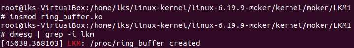
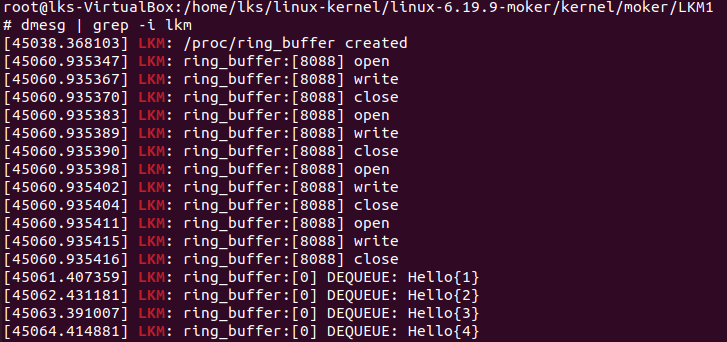
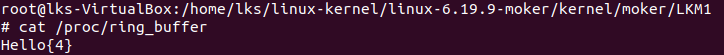
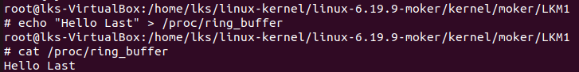
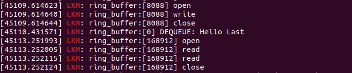

* Printscreens

** Insmod

** Write (4 Messages)

#+begin_src bash
  for i in {1 .. 4}; do
      echo "Hello{$i}" > /proc/ring_buffer;
  done
#+end_src

#+begin_quote
Dequeue occurs every second when ring is not empty.
#+end_quote

** Read (last_message)

#+begin_src bash
  cat /proc/ring_buffer
#+end_src

#+begin_quote
We read the last message dequeued.
#+end_quote

** Write & Read last_message

#+begin_src bash
  echo "Hello Last" > /proc/ring_buffer
#+end_src

#+begin_src bash
  cat /proc/ring_buffer
#+end_src

